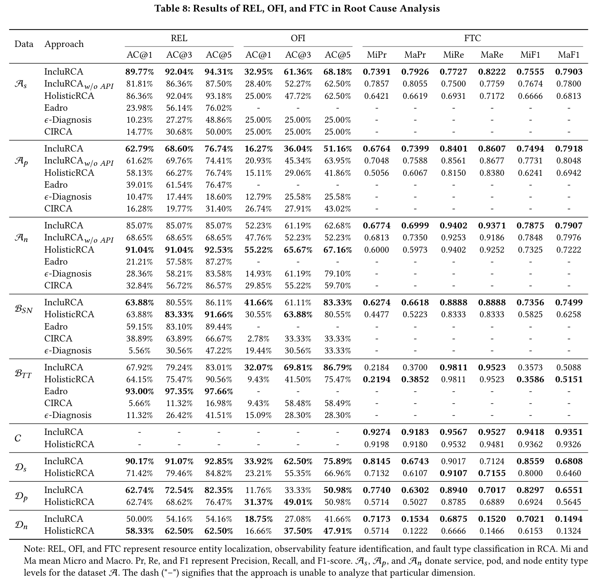
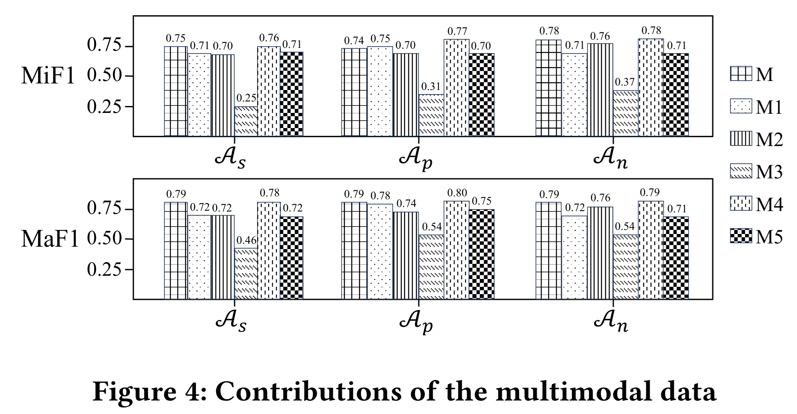
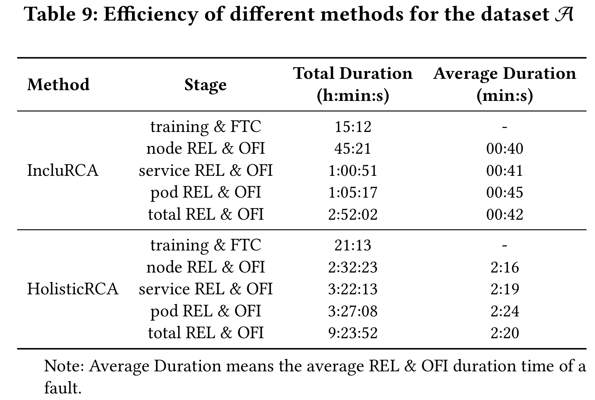
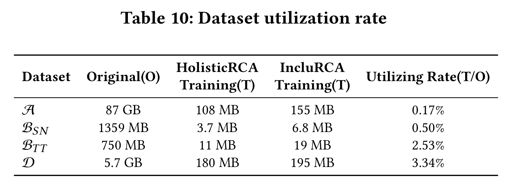

# IncluRCA

Artifacts accompanying IncluRCA, a framework for "Root Cause Analysis based on multimodal Data Augmentation and Channel Attention for Failures in Microservice Systems". 

## Requirements

### Dependencies

````
export PYTHONPATH=/root/shared-nvme/work/code/RCA/IncluRCA/code
cd ./code
pip install -r requirements.txt
````
We also provide our configuration in the experimental environment. File "requirements_experimental_environment.txt" is the pip list of our experimental environment (Note that: the installation of PyTorch followed by https://pytorch.org/get-started/previous-versions/, and torch-scatter and torch-sparse can be doanloaded on https://pytorch-geometric.com/whl/).

### Our Test Environment

- AMD EPYC 7402 24-Core CPU
- 60GB RAM
- NVIDIA GeForce RTX 4090 GPU 24GB
- Ubuntu 20.04.6 LTS
- Python 3.10.14

## Folder Structure

Note: the temp data also needs to be downloaded from https://zenodo.org/records/17410982.

Finally the ``temp_data`` folders need be placed following the structure of the working folder:
````
.
|-- README.md
|-- code
|   |-- IncluRCA                                          the main model of the work
|   |   |-- ablation                                      models for ablation study
|   |   |-- base                                          base classes for model construction
|   |   |-- config                                        configuration of file paths
|   |   |-- data_loader                                   load dataset
|   |   |-- dataset                                       base class for dataset reader
|   |   |-- explain                                       mask learning component (for resource entity localization and fault-related observability data localization)
|   |   |-- model                                         main components except mask learning
|   |   |   |-- common
|   |   |   |   |-- GAT_net.py                            GATNet
|   |   |   |   |-- __pycache__
|   |   |   |   |-- attention_block.py
|   |   |   |   |-- embed.py
|   |   |   |   |-- map_net.py
|   |   |   |-- o11y
|   |   |   |-- re
|   |   |       |-- __pycache__
|   |   |       |-- fault_classifier.py
|   |   |       |-- feature_fusion.py
|   |   |       |-- feature_integration.py                 Transformer module
|   |   |       |-- feature_integration_SEAttention.py     SEAttention module
|   |   |-- trainer                                        perform model training
|   |   |-- util                                           RERG class and data transformation
|   |-- data_filter                                        preprocess data
|   |   |-- CCF_AIOps_challenge_2022                       preprocess dataset A
|   |   |-- CCF_AIOps_challenge_2022_HolisticRCA           preprocess dataset A (HolisticRCA)
|   |   |-- CCF_AIOps_challenge_2025                       preprocess dataset D (no api)
|   |   |-- CCF_AIOps_challenge_2025_api                   preprocess dataset D
|   |   |-- Eadro_TT_and_SN                                preprocess dataset B
|   |   |-- ICASSP_AIOps_challenge_2022                    preprocess dataset C
|   |-- experiments_a.sh                                   experiments for dataset A
|   |-- experiments_b_SN.sh                                experiments for dataset B_SN
|   |-- experiments_b_TT.sh                                experiments for dataset B_TT
|   |-- experiments_c.sh                                   experiments for dataset C
|   |-- experiments_d.sh                                   experiments for dataset D
|   |-- requirements_experimental_environment.txt
|   |-- requirements.txt
|   |-- shared_util                                        some basic util functions
|-- model                                                  saved model data for reproduction
|-- temp_data                                              saved temp data for reproduction
|-- result
|   |-- experiments_a.log                                  experiments' results for dataset A
|   |-- experiments_b_SN.log                               experiments' results for dataset B_SN
|   |-- experiments_b_TT.log                               experiments' results for dataset B_TT
|   |-- experiments_c.log                                  experiments' results for dataset C
|   |-- experiments_d.log                                  experiments' results for dataset D
|-- docs                                                   evaluation results picture for RQ1~RQ4
````

## Quick Start / Reproducibility

### produce train, valid and test data

Then run the following Python scripts to preprocess raw data.

````
cd ./code
python ./data_filter/CCF_AIOps_challenge_2022/dao/ground_truth_dao.py
python ./data_filter/CCF_AIOps_challenge_2022/dao/topology_dao.py
python ./data_filter/CCF_AIOps_challenge_2022/dao/metric_dao.py
python ./data_filter/CCF_AIOps_challenge_2022/dao/log_dao.py
python ./data_filter/CCF_AIOps_challenge_2022/dao/trace_dao.py
python ./data_filter/CCF_AIOps_challenge_2022/dao/api_dao.py
python ./data_filter/CCF_AIOps_challenge_2022/service/time_interval_label_generator.py
python ./data_filter/CCF_AIOps_challenge_2022/service/ent_edge_index_generator.py
python ./data_filter/CCF_AIOps_challenge_2022/service/metric_generator.py
python ./data_filter/CCF_AIOps_challenge_2022/service/log_generator.py
python ./data_filter/CCF_AIOps_challenge_2022/service/trace_generator.py
python ./data_filter/CCF_AIOps_challenge_2022/service/api_generator.py
python ./data_filter/CCF_AIOps_challenge_2022/service/dataset_generator.py
````

### Prerequisites

1. Prepare the Python packages in ``requirements.txt``.
2. Unzip ``temp_data.zip``.

### Simple Result Checking

Following the files ``experiments_a.sh``, ``experiments_b_SN.sh``, ``experiments_b_TT.sh``, ``experiments_c.sh``, or ``experiments_d.sh`` and comment out ``rca_data_trainer.train()`` in the corresponding training files. It will output the evaluation results (note that some file paths need to be changed).

### Running

````
cd ./code
bash experiments_a.sh
bash experiments_b_SN.sh
bash experiments_b_TT.sh
bash experiments_c.sh
bash experiments_d.sh
````

## Evaluation Results
### RQ1: How effective is IncluRCA in three RCA tasks?

### RQ2: What is the contribution of multimodal data?

### RQ3: How efficient is IncluRCA in model training and inference?

### RQ4: What is the dataset utilization rate in IncluRCA?


## Raw Data

Since the raw data is too big, we list their links here, help for downloading:

- Dataset A: https://competition.aiops-challenge.com/home/competition/1496398526429724760. Sometimes the page may be crashed, please visit https://www.bizseer.com/index.php?m=content&c=index&a=show&catid=25&id=83 for simple introduction.
- Dataset B: https://doi.org/10.5281/zenodo.7615393.
- Dataset C: https://www.aiops.sribd.cn/home/introduction. Note that there are no source data for this dataset, so IncluRCA uses pre-treated data from HolisticRCA (https://github.com/baiyanquan/HolisticRCATempData).
- Dataset D: https://challenge.aiops.cn/home/competition/1920410697896845344. aiops-live-benchmark: https://www.aiops.cn/gitlab/aiops-live-benchmark. Note that IncluRCA uses PhaseOne, and the preprocessing of PhaseTwo is the same as PhaseOne in ./code/data_filter/CCF_AIOps_challenge_2025 or ./code/data_filter/CCF_AIOps_challenge_2025_api.


